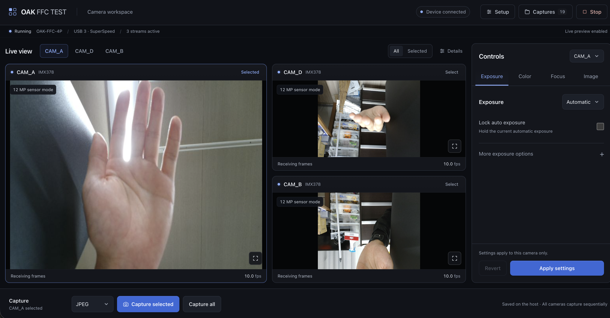

# OAK FFC TEST

A local browser application for exploring and testing the **OAK-FFC 4P USB platform**. Discover connected camera modules, compare live views, adjust imaging controls, and save captures from a single workspace.

The host computer runs the Python application, communicates with the OAK device, and stores images. The browser provides the interface. The project is intended for camera bring-up, module and cable checks, image-quality experiments, and configuration comparisons.

The browser interface uses **React, TypeScript, Vite, and Tailwind CSS**. Production JavaScript and CSS are built locally and served by the Python application, so the workspace works offline without external CDNs.



## Features

- Discover connected camera sockets and reported sensor and autofocus capabilities.
- Select cameras, sensor-mode presets, and frame rates before starting a session.
- View live previews with measured frame rates and frame metadata.
- Use a dark, compact live workspace with camera switching, capture actions, and tabbed camera controls.
- Adjust exposure, ISO, white balance, focus, and image-processing controls, including automatic exposure/white-balance locks, an automatic-exposure time limit, lighting presets, and image effects.
- Save JPEG, PNG, TIFF, BMP, and sensor RAW captures with JSON metadata.
- Capture individual cameras or all active cameras, and download saved files.
- Export technical diagnostics with identifying fields omitted.
- Explore the interface using synthetic demo cameras without attaching hardware.
- Connect directly to a Raspberry Pi Wi-Fi hotspot and use the same browser workspace without a router or Internet connection.

## Current scope and compatibility

Platform support and application support are different. The OAK-FFC 4P has four camera connectors, but this release does not implement every sensor type, sensor mode, or possible combination.

| Area | Current implementation |
| --- | --- |
| Device | One USB OAK-FFC 4P per application instance |
| Host | 64-bit Python 3.10 or newer; Node.js 22.12+ (22.x) or 24+ with npm to build the UI. Linux setup scripts are provided. Hardware testing has used Raspberry Pi OS 64-bit. |
| SDK | DepthAI **2.30.0.0**, using the v2 `ColorCamera` pipeline API |
| Camera selection | Any discovered socket from `CAM_A`, `CAM_B`, `CAM_C`, and `CAM_D`; up to **three active cameras** per session |
| Sensor support | The capture backend currently accepts **IMX378 color modules only**. Other modules may be discovered, but require additional backend support; mono and depth pipelines are not implemented. |
| Mode presets | 1080p, 4K, and 12 MP, with requested frame rates from 2 to 30 FPS. These presets are not supported by every sensor. |
| Focus | Available only when the module reports autofocus support |
| Synchronization | Capture-all requests run sequentially; hardware-synchronized capture is not implemented |

Discovery alone does not establish that a module can stream through this application. Four-camera operation, additional sensor families, and dynamically enumerated sensor modes require implementation and testing before they can be advertised as supported.

The application currently requires matching sensor resolutions when `CAM_A` and `CAM_D` are active together. This guard avoids a mixed-mode failure observed with IMX378 modules and DepthAI 2.30; it is not a universal specification of the board. **Match resolutions** applies the highest selected mode to all selected cameras.

## Hardware preparation

Use a USB3 data connection and a power arrangement suitable for the board and attached modules. Host USB power may be insufficient for a multi-camera configuration. Consult the [Luxonis USB deployment guide](https://docs.luxonis.com/hardware/platform/deploy/usb-deployment-guide) for power, cabling, and host setup.

**Remove USB and external power before connecting, disconnecting, or moving an FFC cable.** Check connector orientation and close each retaining latch before restoring power.

| DepthAI socket | MIPI lanes on OAK-FFC 4P |
| --- | --- |
| `CAM_A` | 4 |
| `CAM_B` | 2 |
| `CAM_C` | 2 |
| `CAM_D` | 4 |

Use the board markings and discovered socket names to identify modules. Check each module's compatibility, lane requirements, and available modes in the [Luxonis FFC guide](https://docs.luxonis.com/hardware/platform/deploy/ffc) and its sensor documentation.

Identical modules on `CAM_B` and `CAM_C` can have coupled camera controls because of their shared I2C connection. Account for this when comparing independently adjusted cameras. [Luxonis engineering discussion](https://discuss.luxonis.com/d/5309-auto-exposure-failure-on-stereo-rig)

## Installation

These commands target Debian-based Linux systems, including Raspberry Pi OS. Run them from a local checkout of the project.

Install system dependencies if needed:

```bash
sudo apt-get update
sudo apt-get install -y python3-venv python3-pip libusb-1.0-0 libglib2.0-0
```

On Linux, allow USB access for members of the `plugdev` group:

```bash
echo 'SUBSYSTEM=="usb", ATTRS{idVendor}=="03e7", MODE="0660", GROUP="plugdev"' | sudo tee /etc/udev/rules.d/80-oak-camera.rules
sudo udevadm control --reload-rules
sudo udevadm trigger --subsystem-match=usb
```

Check group membership with `id -nG`. If necessary, run `sudo usermod -aG plugdev "$USER"`, then log out and back in. Reconnect the OAK after applying the rule. Run the application as your ordinary user.

Install [Node.js](https://nodejs.org/en/download) 24 LTS with npm (`.nvmrc` selects 24 for nvm users; Node 22.12+ in the 22.x series is also supported), then install the Python dependencies and build the browser interface:

```bash
bash scripts/install.sh
```

The installer creates `.venv`, installs `requirements.txt`, runs `npm ci`, and builds the UI into `oak_camera/static/dist/`. It prints system setup instructions but does not execute `sudo` or modify operating-system settings. Use `PYTHON_BIN=/path/to/python3 bash scripts/install.sh` to choose another interpreter. Node and npm are build tools; running the completed Python application does not require them or an Internet connection.

Keep the pinned DepthAI version: the application uses the v2 API and is not compatible with an independent upgrade to v3. Availability of a wheel depends on the host architecture and Python version; consult the [DepthAI 2.30.0.0 package files](https://pypi.org/project/depthai/2.30.0.0/).

## Running

Start the application:

```bash
bash scripts/run.sh
```

Open **http://127.0.0.1:8080** on the host computer. Stop the server with **Ctrl+C** before restarting it.

Common options:

```bash
# Try synthetic cameras without accessing a device.
bash scripts/run.sh --demo

# Choose another port if the default is already occupied.
bash scripts/run.sh --port 8081

# Choose where captures are stored on the host.
bash scripts/run.sh --capture-dir captures

# Select a device when several are connected; replace the placeholder locally.
bash scripts/run.sh --device-id DEVICE_ID
```

The equivalent Python entry point is `.venv/bin/python -m oak_camera`. Run it with `--help` to list options.

After pulling changes to the frontend, run `npm ci && npm run build` before reloading the browser. If the production build is missing, the homepage displays build instructions while the camera API remains available.

### Access from another computer

The default bind address is localhost. Use an SSH tunnel for remote viewing, replacing `USER` and `HOST` with your own connection details:

```bash
ssh -N -L 8080:127.0.0.1:8080 USER@HOST
```

Then open **http://127.0.0.1:8080** on the browsing computer. If its local port is occupied, use a different forwarding port, such as `8081:127.0.0.1:8080`.

Binding with `--host 0.0.0.0` permits access from other computers that can reach the host. The application has **no authentication or TLS**: those clients can view images, change camera settings, and download captures. Keep it on a trusted host/network or use the SSH tunnel; do not expose its port directly to the Internet.

### Automatic startup on Raspberry Pi

For everyday use, the flow is **power on the Pi → join its Wi-Fi hotspot → open http://10.42.0.1:8080**. No terminal commands or scripts are needed on the PC or smartphone. Camera selection and capture controls remain in the browser.

After completing installation, the frontend build, and USB permissions above, register the application once on the Pi:

```bash
sudo python3 scripts/install_service.py
```

Run this from the checkout as your normal application user, using `sudo`. The installer detects that user and the checkout path, enables the saved hotspot at boot, and installs and starts **oak-ffc-test.service**. The application runs as the ordinary user with access to their USB groups and capture directory. The installer also checks that the HTTP API responds before reporting success.

An existing hotspot keeps its SSID, address, and fixed password. If no hotspot exists, the installer creates **OAK-FFC-TEST**, generates a password once, and prints it for you to save. To choose your fixed password during the one-time setup, use:

```bash
sudo python3 scripts/install_service.py --password 'YOUR_FIXED_PASSWORD'
```

Use 8–63 printable ASCII characters; `--password-file /path/to/private-password-file` is also supported. When running directly as root, specify the ordinary application account with `--user YOUR_USER`. Use `--port 8081` or `--capture-dir /path/to/captures` if needed. `--demo` installs a service using synthetic cameras for testing; rerun without it for real hardware. Reinstalling with no password option preserves the saved password and updates the service options.

Stop any manually started copy of the app before installation so it can use the chosen port. Use a local keyboard/display or Ethernet for initial setup: enabling the hotspot replaces the Wi-Fi connection on its adapter. NetworkManager must manage an AP-capable adapter, and the Pi's WLAN country must be configured as described below. The installer does not reboot the Pi.

After installation, the app and hotspot start automatically on subsequent boots, without logging in. The app listens on port **8080** by default, including the hotspot interface, and systemd restarts it if it exits with an error. NetworkManager retries hotspot startup if the adapter is not ready yet. Startup does not depend on an Internet connection. Keep the checkout and its `.venv` at the installed path; rerun the installer if you move them.

Maintenance commands are only needed on the Pi when changing the setup:

```bash
systemctl status oak-ffc-test.service
sudo systemctl restart oak-ffc-test.service
journalctl -u oak-ffc-test.service -n 50 --no-pager
```

To disable automatic app startup and stop it, run `sudo systemctl disable --now oak-ffc-test.service`. Hotspot startup is managed separately; `sudo python3 scripts/hotspot.py stop` stops broadcasting and disables its automatic connection. To restore the complete power-on setup, rerun `sudo python3 scripts/install_service.py`.

### Direct access through a Raspberry Pi hotspot

The Raspberry Pi can broadcast its own **OAK-FFC-TEST** Wi-Fi network. Connect a PC, tablet, or smartphone to it and open **http://10.42.0.1:8080**. The UI, live previews, camera controls, captures, downloads, and diagnostics are the same as on the Pi. All browser assets are served locally, so the app works without Internet access. Captures are stored on the Pi; downloading copies them to the browsing device. Connected browsers share the same camera session and settings.

This setup targets Raspberry Pi OS **Bookworm or Trixie** with NetworkManager and an AP-capable Wi-Fi adapter, normally `wlan0`. NetworkManager manages DHCP, DNS, and optional Internet sharing through its `shared` IPv4 mode; separate `hostapd` or `dnsmasq` services are unnecessary. See the [NetworkManager shared-network documentation](https://networkmanager.pages.freedesktop.org/NetworkManager/NetworkManager/nm-settings-nmcli.html#ipv4-setting).

Run the following commands **on the Pi**, from this checkout. Use a local keyboard/display or Ethernet for the initial setup: starting the hotspot replaces the existing Wi-Fi connection on the selected adapter and can disconnect a Wi-Fi SSH session. Ethernet stays available. If you need Wi-Fi Internet access while broadcasting the hotspot, use a second Wi-Fi adapter; Ethernet can also provide the upstream connection.

1. Check NetworkManager and the Wi-Fi adapter:

   ```bash
   nmcli general status
   nmcli device status
   nmcli -f WIFI-PROPERTIES.AP device show wlan0
   ```

   The AP capability must be `yes`. If `nmcli` or `dnsmasq` is missing, install the dependencies with `sudo apt-get update` and `sudo apt-get install -y network-manager dnsmasq-base`. On an older OS using `dhcpcd`, use a supported NetworkManager setup before running these tools.

2. Set the WLAN country to the country where the Pi is used, if it has not already been configured: run `sudo raspi-config` and select **Localisation Options → WLAN Country**. Enable the Wi-Fi radio:

   ```bash
   sudo nmcli radio wifi on
   ```

   The [Raspberry Pi wireless setup documentation](https://www.raspberrypi.com/documentation/computers/configuration.html#enable-wireless-networking-set-wlan-country) explains country selection and radio enablement.

3. Create the hotspot profile:

   ```bash
   sudo python3 scripts/hotspot.py configure
   ```

   On first setup, this command generates a Wi-Fi password and prints it once; save it. Later `configure` calls reuse the saved password when the SSID stays the same. Starting, stopping, or rebooting does not change it. The tool creates a WPA2 network on 2.4 GHz, gives the Pi the fixed address `10.42.0.1/24`, and stores a protected profile outside the checkout. It does not activate Wi-Fi or change the current connection.

   To choose a **fixed password**, set it once with the following command, replacing the placeholder with your own password:

   ```bash
   sudo python3 scripts/hotspot.py configure --password 'YOUR_FIXED_PASSWORD'
   ```

   WPA2 requires 8–63 printable ASCII characters. This password is saved and stays the same until you explicitly replace it with `--password` or `--password-file`. If the hotspot is already running, stop it with `sudo python3 scripts/hotspot.py stop` before changing its configuration, then start it again afterward.

   To choose another name or adapter, use `--ssid 'YOUR_SSID' --interface wlan1`. If you change an existing hotspot's SSID, supply the password again with `--password` or `--password-file`; you can use the same password. Alternatively, provide a private file containing the passphrase with `--password-file /path/to/private-password-file`; keep that file outside Git and restrict its permissions. The two password options are mutually exclusive. If `10.42.0.0/24` overlaps another network attached to the Pi, choose another private subnet with `--address 10.43.0.1/24`; changing only the address or adapter reuses the saved password.

4. Start the hotspot and enable its automatic connection after reboot:

   ```bash
   sudo python3 scripts/hotspot.py start
   python3 scripts/hotspot.py status
   ```

5. Stop any existing app instance with **Ctrl+C** in its original terminal, then launch the app with network access:

   ```bash
   bash scripts/run_hotspot.sh
   ```

   This launcher reads the configured hotspot address, prints the browser URL, and runs the existing app with a default bind address of `--host 0.0.0.0`. Options such as `--demo`, `--port 8081`, and `--capture-dir captures` work as before; `--host` can override the bind address. By default it also accepts connections through other connected interfaces, including Ethernet; use trusted networks. The equivalent command is `bash scripts/run.sh --host 0.0.0.0`.

6. On the other device, join **OAK-FFC-TEST** using the saved password and open **http://10.42.0.1:8080**, or the address/port you selected. If the device reports **No Internet**, choose to stay connected; the app does not need Internet access. On phones, disable automatic switching to mobile data or another Wi-Fi network if the browser cannot reach the Pi. There is no captive portal, so enter the URL in the browser explicitly.

The hotspot reconnects automatically at boot after a successful `start`. To start the web application automatically as well, use the [one-time service installer](#automatic-startup-on-raspberry-pi) above. Use the manual launcher when testing or changing the setup with the service disabled.

To stop broadcasting and disable hotspot startup at boot:

```bash
sudo python3 scripts/hotspot.py stop
```

This preserves the saved hotspot and other network profiles. NetworkManager may reconnect a previously saved Wi-Fi network; otherwise select it from the Pi's network menu or run `sudo nmcli connection up id 'YOUR_PREVIOUS_CONNECTION'`. Start the hotspot again with `sudo python3 scripts/hotspot.py start`.

| Hotspot symptom | Checks |
| --- | --- |
| SSID does not appear | Run `python3 scripts/hotspot.py status`, `nmcli radio wifi`, and `rfkill list`. Enable Wi-Fi, set the correct WLAN country, and confirm AP capability on the selected adapter. |
| Connected but the app does not open | Confirm the app is running with `--host 0.0.0.0`; localhost-only binding does not accept hotspot clients. Use the configured Pi address and app port, and stay connected despite the No Internet message. |
| Another network uses the same subnet | Stop the hotspot and configure it with another private `/24`, such as `--address 10.43.0.1/24`, then start it again. The saved password is reused when the SSID stays the same. |
| DHCP or activation fails | Confirm `dnsmasq-base` is installed and inspect `journalctl -u NetworkManager -n 50 --no-pager`. Existing standalone AP/DHCP services can conflict with NetworkManager. |
| Firewall blocks the browser | If a firewall is enabled, allow TCP on the app port from the hotspot interface/subnet and DHCP/DNS for clients; keep the existing firewall enabled. |
| App disappears after reboot | Run the service installer and check `systemctl status oak-ffc-test.service` and its journal. Confirm that the checkout and `.venv` remain at the installed path. |

## A typical test session

1. With power disconnected, attach the modules and FFC cables to be evaluated.
2. Restore power, launch the application, and open **Setup** to scan for connected cameras.
3. Select the intended sockets in Setup and start with a conservative supported mode, such as 1080p at 10 FPS with RAW disabled.
4. Confirm that every selected camera produces fresh frames. Compare measured FPS and frame metadata with the requested settings.
5. Change one imaging control at a time and inspect its effect. Allow automatic exposure, white balance, and focus to settle.
6. Save a processed capture and check its dimensions and image quality.
7. To test RAW, stop the streams, enable RAW, restart, and capture again.
8. Change one variable at a time when comparing resolutions, frame rates, modules, cables, or sockets. Remove all board power before changing physical connections.

Selecting a subset of attached modules tests a subset of streams. Testing a physically isolated module requires disconnecting the other modules while the board is powered off.

Resolution and FPS changes rebuild the pipeline. Exposure duration must fit within the selected frame period. Image-processing controls affect processed output; RAW retains sensor samples and needs its own development workflow.

### Live workspace

The live workspace keeps camera selection, previews, and capture actions together. Setup and saved-capture history open separately, so they do not push the live images down the page. Use **Setup** for camera selection, resolution, FPS, and RAW enablement; use **Captures** to review and download saved files. Close either dialog with its close button or **Escape**.

The workspace shows the relevant **Start** or **Stop** action. Camera cards always show frame health and FPS; turn on **Details** to see exposure, ISO, white balance, lens position, and frame counts. Manual inputs appear when you choose a manual mode. Expand **More exposure options**, **More color options**, or **Sharpness & noise** for additional controls.

Select a camera next to the previews to edit its settings. **Capture selected** saves that camera; **Capture all** saves each active camera sequentially. The control panel has four tabs:

| Tab | Controls |
| --- | --- |
| Exposure | Automatic/manual exposure and ISO, automatic-exposure lock, maximum automatic exposure time, exposure compensation, and anti-banding |
| Color | Automatic/manual white balance, lighting presets, automatic white-balance lock, and saturation |
| Focus | Continuous autofocus, one-shot autofocus, and manual lens position on autofocus-capable modules |
| Image | Brightness, contrast, sharpness, luma/chroma denoise, and off/monochrome/negative/sepia effects |

Press **Apply settings** to send changes to the selected camera. Unapplied edits stay with each camera while you switch between them; **Revert** discards those edits. In one-shot focus mode, **Run autofocus once** starts a new focus adjustment. On narrow screens, the workspace shows the selected camera and scrolls the control panel internally, keeping capture and camera-switching actions accessible.

Exposure and white-balance locks freeze the respective automatic adjustment; switching to manual exposure or a white-balance preset releases its lock. White-balance presets include incandescent, fluorescent, warm fluorescent, daylight, cloudy, twilight, and shade.

The automatic-exposure limit is in microseconds. **0** uses the selected frame period as the ceiling; a positive value must fit within that period. For example, 10 FPS allows at most 100,000 µs, while a 5,000 µs ceiling can help limit motion blur by allowing the automatic algorithm to raise ISO instead. Actual settings remain subject to sensor limits and anti-banding. These controls use the pinned SDK's [CameraControl API](https://github.com/luxonis/depthai-core/blob/v2.30.0/include/depthai/pipeline/datatype/CameraControl.hpp).

Color presets and effects change processed previews and stills; they do not alter Bayer RAW samples. Exposure settings affect both processed images and RAW. Demo mode illustrates the interface and some image effects but does not validate the device's automatic algorithms.

## Captures and RAW data

Captures are saved on the **host computer**, under `--capture-dir` (default: `captures/`). Downloading a file in the browser copies it to the browsing computer; it does not change the host capture directory.

| Format | Contents |
| --- | --- |
| JPEG | Lossy compressed processed color image |
| PNG | Lossless stored processed color image |
| TIFF | Processed color image in a TIFF container |
| BMP | Uncompressed processed color bitmap |
| RAW | Original sensor payload from `ColorCamera.raw` |
| JSON sidecar | Dimensions, layout, camera settings, and available frame metadata |

Live previews are downscaled to keep the interface responsive. Still and RAW outputs retain the selected mode's output dimensions, which can differ from each other. Use each capture's metadata as the authoritative dimensions and layout.

RAW must be enabled before starting a session. A device-side gate sends a RAW frame only when requested, avoiding a continuous full-resolution RAW stream over USB. RAW still uses additional device buffers.

The tested IMX378 RAW output is packed MIPI RAW10, reported by DepthAI as `PACK10`. Four 10-bit samples occupy five bytes. DepthAI's `RAW10` enum instead describes 10-bit samples stored in 16-bit words. The application preserves the received bytes and records their layout; the file is not a DNG. [DepthAI frame type definitions](https://github.com/luxonis/depthai-shared/blob/main/include/depthai-shared/datatype/RawImgFrame.hpp)

For a saved MIPI RAW10 capture, unpack sensor values into a NumPy `uint16` array:

```bash
.venv/bin/python -m oak_camera.raw captures/CAPTURE_ID/image.raw
```

Replace `CAPTURE_ID` with the saved capture folder. The command reads `metadata.json`, respects row stride, and creates `image.npy` without overwriting existing files. Values remain in the range 0–1023. The decoder does not infer Bayer order, demosaic, or perform color correction, and it does not decode every RAW layout recognized by the capture backend.

Capture-all is sequential. Captures from different cameras, and processed and RAW captures from the same camera, can have different timestamps.

## Troubleshooting and diagnostics

| Symptom | Checks |
| --- | --- |
| Port already in use | Stop the existing server or select another `--port`. |
| Interface has not been built | Install Node.js 24 LTS with npm, then run `npm ci && npm run build` from the checkout. |
| No available device | Check power, USB cabling, Linux USB permissions, and whether another program owns the device. |
| Missing camera | Power off before checking FFC orientation, latches, module compatibility, and the selected socket. |
| Mixed-resolution warning | Match the modes on `CAM_A` and `CAM_D`, or use **Match resolutions** before starting. |
| Low FPS or stalled previews | Start with fewer active streams, reduce the requested load, and check power and negotiated USB speed. |
| RAW unavailable | Stop, enable RAW, and restart; verify that the module and mode support RAW output. |
| Out-of-memory error | Reduce the number of active streams or resolution, or disable RAW. Lowering FPS alone does not reduce all frame-pool allocations. |

A reported USB speed of `HIGH` indicates USB2; `SUPER` or `SUPER_PLUS` indicates USB3. A USB3 connector does not guarantee USB3 negotiation. Sensor throughput, device memory, USB transfers, and host processing can each limit a configuration.

Current previews are 640 × 360, or 640 × 480 in 12 MP mode. Increasing sensor resolution increases device processing and buffer use without proportionally increasing continuous preview traffic. Full-resolution capture transfers can temporarily affect preview FPS.

Download technical diagnostics using the UI or:

```bash
curl --fail http://127.0.0.1:8080/api/report -o oak-report.json
```

This export contains allowlisted configuration, frame-health, control, and software-version information. Device identifiers, local filesystem paths, captured images, capture history, freeform errors, and detailed session events are omitted. Error counts are retained. Review any report before attaching it to a public issue; it still describes the hardware/software configuration in use.

## Privacy and publication

The repository should contain code, documentation, sanitized examples, and synthetic test fixtures. It should not contain recordings from a real workspace, personal connection details, credentials, or local machine state.

- `.gitignore` excludes captures, test output, crash caches, logs, virtual environments, local editor/agent settings, and `.env` files. Example environment templates remain trackable and must contain placeholders only.
- Add custom `--capture-dir` and test `--output` locations to the ignore rules if they are inside the checkout.
- The local interface, capture sidecars, hardware-check reports, SDK output, and screenshots can contain device identifiers, timestamps, filesystem paths, or private image content. These local artifacts are distinct from the filtered diagnostic download and are not publication examples.
- Before loading DepthAI, the application disables its automatic crash-report uploads and pipeline analytics. With the pinned v2 SDK this uses `DEPTHAI_DISABLE_CRASHDUMP_COLLECTION=1` and an empty `DEPTHAI_ENABLE_ANALYTICS_COLLECTION`; the SDK may still write local crash diagnostics. [DepthAI v2.30 collection implementation](https://github.com/luxonis/depthai-core/blob/v2.30.0/src/utility/LogCollection.cpp)
- Keep local captures and diagnostic artifacts private. Ignoring a path does not remove files already tracked by Git or erase earlier commits.
- Before publishing, inspect staged files and repository history for sensitive content. Do not force-add ignored captures, logs, caches, environment files, or machine-specific configuration.

Useful checks after initializing a Git repository:

```bash
git status --short --ignored
git diff --cached --stat
git diff --cached
```

Documentation uses placeholders such as `DEVICE_ID`, `USER`, `HOST`, and `CAPTURE_ID`. Substitute real values only in your local commands; do not commit them into examples.

## Development and validation

Install frontend dependencies and check the TypeScript source and production build:

```bash
npm ci
npm run typecheck
npm run build
```

For development with automatic browser updates, run the demo backend and Vite in separate terminals:

```bash
# Terminal 1: Python API and synthetic cameras.
bash scripts/run.sh --demo

# Terminal 2: React development server.
npm run dev
```

Open **http://127.0.0.1:5173**. Vite proxies `/api`, `/stream`, and `/captures` to the Python server on port 8080. Browser requests retain their matching `Host` and `Origin`, preserving the API's cross-origin mutation check. To use another backend port, run `OAK_API_PROXY_TARGET=http://127.0.0.1:8081 npm run dev`. Keep API, stream, and download URLs relative to the current browser origin.

For the offline production interface, use `npm run build` and browse the Python server on port 8080. A Vite server is only needed while developing the frontend. The configuration follows the official [Vite backend integration guide](https://vite.dev/guide/backend-integration) and [Tailwind Vite setup](https://tailwindcss.com/docs/installation/using-vite).

Install Python development dependencies and run the automated checks:

```bash
.venv/bin/python -m pip install -r requirements-dev.txt
.venv/bin/python -m pytest
```

To exercise the browser interface, start a separate demo instance and run the smoke test in another terminal:

```bash
.venv/bin/python -m oak_camera --demo --port 8081 --capture-dir /tmp/oak-demo-captures
# In another terminal:
.venv/bin/python tests/browser_smoke.py http://127.0.0.1:8081
```

The browser test uses `/usr/bin/chromium` by default; use `--chromium` to override it. It refuses real-device mode and saves screenshots under `test-results/`.

For an explicit hardware check, close the running camera application first. Choose sockets and a mode appropriate to the attached modules, for example:

```bash
.venv/bin/python scripts/check_hardware.py --sockets CAM_A --resolution 1080p --fps 10 --raw
```

Additional socket names select additional streams within the application's current limit. The script saves processed/RAW samples and a detailed local report under `captures/hardware-checks/`; treat that output as private.

Automated checks cover API validation, hotspot-address browser requests, hotspot profile configuration and recovery, service installation and startup with mocked system commands, capture storage, RAW10 decoding, pipeline construction, lifecycle recovery, compatibility guards, and diagnostic privacy. Demo checks exercise the interface without proving physical hardware compatibility or Wi-Fi radio/client connectivity. Previous short hardware checks covered IMX378 color modules, including matching dual 4K and dual 12 MP at 10 FPS with JPEG and RAW capture. These results do not establish support for other modules, every socket combination, or long-duration operation.

## Project layout

| Path | Purpose |
| --- | --- |
| `oak_camera/backend.py` | Device discovery, pipelines, controls, and capture |
| `oak_camera/app.py` | HTTP API, previews, downloads, diagnostics, and built UI hosting |
| `oak_camera/diagnostics.py` | Allowlisted technical diagnostic exports |
| `frontend/src/` | React components, typed API models, and Tailwind styles |
| `frontend/index.html`, `vite.config.ts`, `tsconfig*.json` | UI entry page, development proxy, production build, and strict TypeScript configuration |
| `package.json`, `package-lock.json` | Frontend dependencies and reproducible npm build commands |
| `oak_camera/static/dist/` | Generated offline frontend assets and Vite manifest; excluded from Git |
| `oak_camera/raw.py` | MIPI RAW10 unpacking utility |
| `scripts/` | Installation, launcher, and hardware-check tools |
| `scripts/hotspot.py`, `scripts/run_hotspot.sh` | Persistent Raspberry Pi hotspot management and network-accessible app launcher |
| `scripts/install_service.py` | One-time systemd registration, hotspot boot setup, and app startup verification |
| `tests/` | Automated checks and browser smoke test |
| `captures/`, `test-results/` | Local generated output; excluded from Git |
